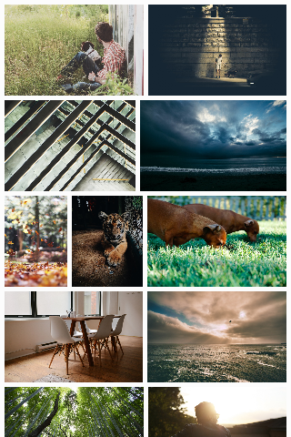

# Flexbin

Flexible and gapless image gallery layout like Google Images and 500px.com. Based on [article](https://github.com/xieranmaya/blog/issues/6) of [xieranmaya](https://github.com/xieranmaya)

- Pure CSS, no need for JavaScript or server side calculation
- Responsive, nice look on both desktop and mobile devices
- Gapless, all spaces between images are the same
- Little cropping, no deformation
- SaSS support
- Chrome 31+, Firefox 36+, Safari 10+




**Demo**: <https://guoyunhe.me/demo/flexbin/>

## Get Started

### Download

1. Download this git repo as zip or tar.gz file.
2. NPM `npm install flexbin`
3. Bower (TODO)

### Import

Use `flexbin.css` in your HTML:

```html
<link href="path/to/flexbin.css" type="text/css" rel="stylesheet" media="all" />
```

or import `flexbin.scss` in your SaSS project:

```scss
@import "path/to/flexbin.scss";
```

### Markup

HTML markup is very simple:

```html
<div class="flexbin">
    <a href="product/1.html">
        
    </a>
    <a href="product/2.html">
        
    </a>
    <a href="product/3.html">
        
    </a>
    ...
</div>
```

If you want extra space surround Flexbin gallery, use "flexbin-margin" class:

```html
<div class="flexbin flexbin-margin">
    <a href="product/1.html">
        
    </a>
    <a href="product/2.html">
        
    </a>
    <a href="product/3.html">
        
    </a>
    ...
</div>
```

### Customize with SaSS

If you use SaSS, you can customize Flexbin further:

```scss
// Desktop, large screen devices
$flexbin-row-height: 200px; // height of image rows
$flexbin-space: 10px; // space between images

// Tablet, medium screen devices
$flexbin-tablet-max: 800px;
$flexbin-row-height-tablet: 150px;
$flexbin-space-tablet: 8px;

// Phone, small screen devices
$flexbin-phone-max: 400px;
$flexbin-row-height-phone: 100px;
$flexbin-space-phone: 4px;

@import "path/to/flexbin.scss";

.my-flexbin {
    @include flexbin(100px, 8px);
}

.my-flexbin-large {
    @include flexbin(400px, 20px);

    @media (max-width: 768px) {
        @include flexbin(200px, 10px);
    }
}
```

## TODO

- Publish on Bower, Composer, Gem, etc.
- Fallback mode for IE, Edge and other old browsers

## Copyright & License

Copyright 2017 [Guo Yunhe](mailto:guoyunhebrave@gmail.com) & xieranmaya. Code released under GNU General Public License version 3 or later. See [LICENSE](LICENSE).
